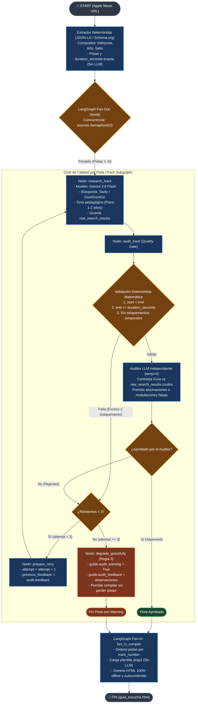

# Diagrama del Grafo LangGraph

Presiona **`Cmd + Shift + V`** (o haz clic en el icono de vista previa en la esquina superior derecha de VS Code) para ver este diagrama renderizado:

```mermaid
flowchart TD
    classDef startEnd fill:#2d3748,stroke:#4a5568,stroke-width:2px,color:#fff;
    classDef process fill:#1a365d,stroke:#2b6cb0,stroke-width:2px,color:#edf2f7;
    classDef decision fill:#744210,stroke:#d69e2e,stroke-width:2px,color:#fff;
    classDef warning fill:#7b341e,stroke:#dd6b20,stroke-width:2px,color:#fff;
    classDef success fill:#1c4532,stroke:#38a169,stroke-width:2px,color:#fff;

    START(["🚀 START (Apple Music URL)"]):::startEnd --> EXTRACT["Extractor Determinista (JSON-LD / Schema.org)<br/>- Compositor, Intérprete, Año, Sello<br/>- Pistas y duration_seconds exacta (Sin LLM)"]:::process

    EXTRACT --> FAN_OUT{"LangGraph Fan-Out: Send()<br/>Concurrencia: asyncio.Semaphore(3)"}:::decision

    subgraph SUBGRAPH_TRACK ["Ciclo de Calidad por Pista (Track Subgraph)"]
        direction TB

        RESEARCH["Nodo: research_track<br/>- Modelo: Gemini 3.8 Flash<br/>- Búsqueda: Tavily / DuckDuckGo<br/>- Tono pedagógico (Piano 1-2 años)<br/>- Guarda raw_search_results"]:::process

        AUDIT_GATE["Nodo: audit_track (Quality Gate)"]:::process

        DET_CHECK{"Validación Determinista Matemática<br/>1. start < end<br/>2. end <= duration_seconds<br/>3. Sin solapamientos temporales"}:::decision

        LLM_AUDIT["Auditor LLM Independiente (temp=0)<br/>Contrasta Guía vs raw_search_results crudos<br/>Prohíbe alucinaciones o modulaciones falsas"]:::process

        EVAL_AUDIT{"¿Aprobado por el Auditor?"}:::decision

        CHECK_RETRIES{"¿Reintentos < 3?"}:::decision

        PREPARE_RETRY["Nodo: prepare_retry<br/>- attempt = attempt + 1<br/>- previous_feedback = audit.feedback"]:::process

        GRACEFUL_DEG["Nodo: degrade_gracefully (Regla 3)<br/>- guide.audit_warning = True<br/>- guide.audit_feedback = observaciones<br/>- Permite compilar sin perder pistas"]:::warning

        TRACK_APPROVED(["Pista Aprobada"]):::success

        RESEARCH --> AUDIT_GATE
        AUDIT_GATE --> DET_CHECK
        DET_CHECK -- "Falla (Exceso o Solapamiento)" --> CHECK_RETRIES
        DET_CHECK -- "Válido" --> LLM_AUDIT
        LLM_AUDIT --> EVAL_AUDIT

        EVAL_AUDIT -- "Sí (Approved)" --> TRACK_APPROVED
        EVAL_AUDIT -- "No (Rejected)" --> CHECK_RETRIES

        CHECK_RETRIES -- "Sí (attempt < 3)" --> PREPARE_RETRY
        PREPARE_RETRY --> RESEARCH

        CHECK_RETRIES -- "No (attempt >= 3)" --> GRACEFUL_DEG
        GRACEFUL_DEG --> TRACK_DONE(["Fin Pista con Warning"]):::warning
    end

    FAN_OUT -->|"Paralelo (Pistas 1..N)"| RESEARCH

    TRACK_APPROVED --> FAN_IN
    TRACK_DONE --> FAN_IN

    FAN_IN["LangGraph Fan-In: fan_in_compile<br/>- Ordena pistas por track_number<br/>- Carga plantilla Jinja2 (Sin LLM)<br/>- Genera HTML 100% offline y autocontenido"]:::process

    FAN_IN --> END_NODE(["🏁 FIN (guia_escucha.html)"]):::startEnd
```
